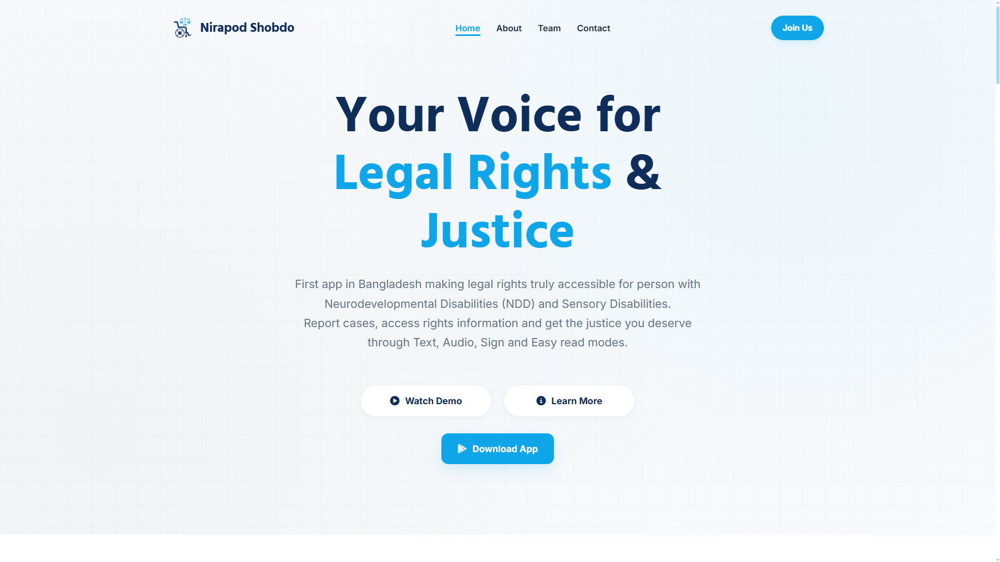

# Nirapod Shobdo

## Overview
**Nirapod Shobdo (নিরাপদ শব্দ)** is a web platform built to promote and support the **Nirapod Shobdo mobile application** - an inclusive solution focused on **Legal Rights & Justice** for individuals with:
* Neurodevelopmental Disabilities (NDD)
* Sensory Disabilities

The platform introduces users to the app and its mission: making justice **accessible, understandable, and inclusive for everyone**.

## About This Website
This website serves as:
* A **promotional platform** for the Nirapod Shobdo app
* An **information hub** about its purpose and features
* A **gateway** for users to explore and adopt the app

## Live Preview
Check out the live preview of [**Nirapod Shobdo**](https://nirapod-shobdo.com/)

## Demo Preview
<p align="center">
  
</p>

## Tech Stack
* **Frontend:** HTML, CSS, JavaScript
* **Deployment:** Netlify
* **Version Control:** Git & GitHub

## Project Structure
```
nirapod-shobdo/
│── index.html
│── style.css
│── script.js
│── assets/
│── README.md
```

## Usage
1. Visit the live website
2. Learn about the Nirapod Shobdo app
3. Explore its accessibility features
4. Understand how it supports legal rights and justice

## Author
This project was developed by [**Niloy Ahsan**](https://github.com/niloyahsan1)

## License
This project is licensed under the MIT License.

---
